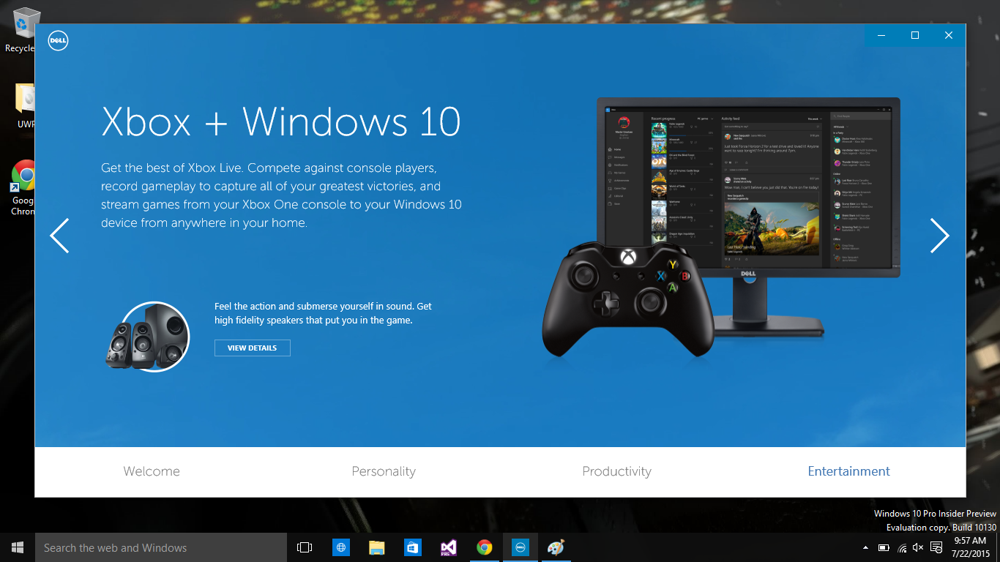

Designed and co-developed with one other developer from the ground up, Dell's "Welcome to Windows 10" application for all users with a Dell computer upgrading to Windows 10. This was a global application that supported over 25 different languages and was fully responsive - it is estimated to server hundreds of thousands of people as soon as Windows 10 is available, with millions of people estimated several months after Windows 10 is released. Every link worked correctly for all the languages and locations and the layout supported RTL localizations as well.

Landing pages

##### Universal Windows Platform

It was developed on the Universal Windows Platform framework which is brand new to the Windows development cycle here at Dell at the time of this apps creation. We were some of the first devs to get our hands dirty developing for Win10. We were in direct contact with Microsoft as we were developing this application pre-Windows 10 release date so Microsoft's documentation was constantly changing if not completely inaccurate as they were constantly updating Windows 10. Interfacing with them directly allowed us to develop this application so it would work correctly once Windows 10 was released.

Upsell pages

##### Timeline

This entire application had a 10 day hard cut turn around required. We managed to get everything mentioned above designed and finished in that time period with about 24 hours to spare. Thanks to a great team the application even earned some high praise from executives at Microsoft and here at Dell.
