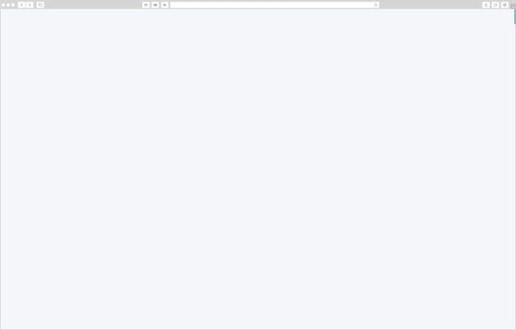

#####Design Compliance

This toolkit allows devs to quickly become Clarity 3 compliant without having to change their workflow. Also allows devs to easily stay up-to-date with Clarity as it's extremely easy to update the toolkit. Semantic versioning is used to help teams decide the correct approach for any larger API updates.

Snipppets from the Clarity 3 design language

#####Extended Functionality

The bootstrap based (custom fork) toolkit brings some extended functionality to the existing Bootstrap core. These include things like more fleshed out alerts that allow for more user interaction out of the box. Also included are components like Dell's masthead design and "Megamenus". All of these and more are included in an extra JS core the devs would use if they wanted this extra functionality, but allow for a 'light' version without the extra JS overhead if desired.

Dashboard animation with extended functionality

#####Future Versions

The Clarity toolkit has expanded greatly since I initially lead the first effort. As of this writing it is one major version ahead. There are new toolkits based on technologies like React, Angular, and VueJS. Throughout this process I interfaced with many different developers to gather their opinions and was able to facilitate my own ideas in a way that had many executives excited about what we could do with Clarity web toolkit, while laying good foundation for us as a company to continue to build on the Clarity toolkit idea as the design language grew and changed.