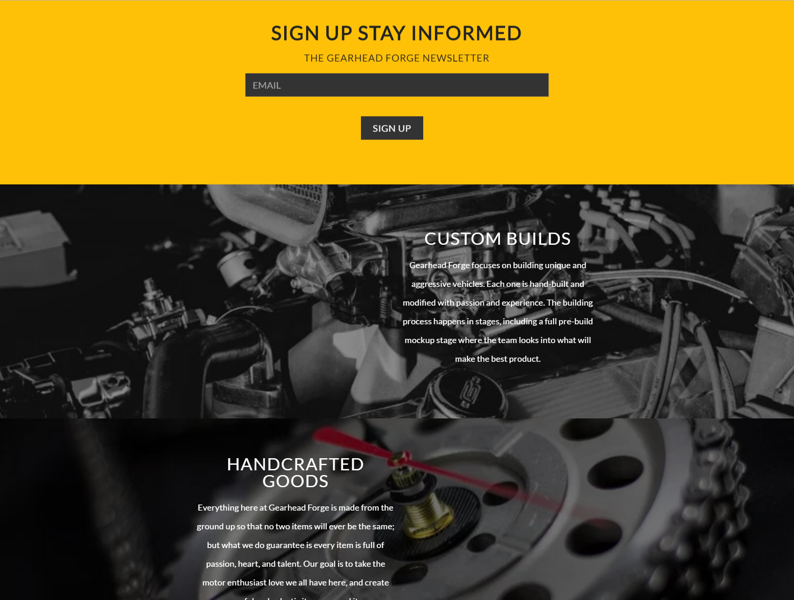
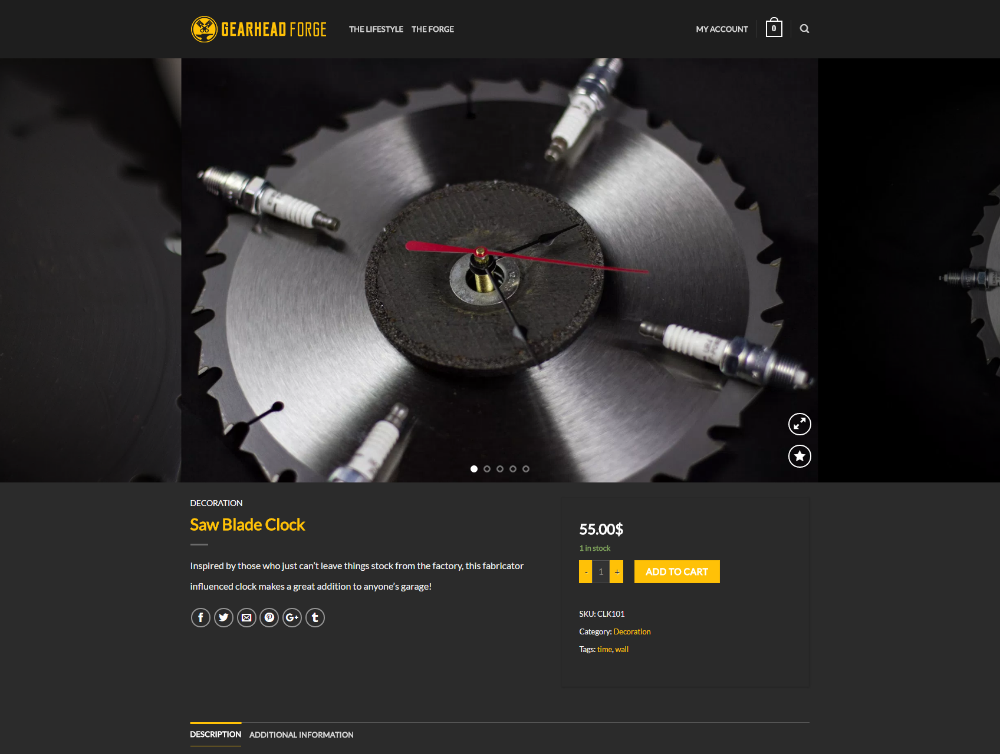

The idea for Gearhead Forge came from the passion and desire to build unique vehicles and keep the flame of hot rodding alive! I designed the brand identity over a couple of weeks and after several logo iterations I landed on the blacksmith inspired logo meant to call attention to the 'forging' aspect of Gearhead Forge.

Gearhead Forge logos

##### Frontend

The frontend design heavily utilizes imagery to help build the brand and theme. It's built on responsive modern technologies (HTML5,CSS3/Sass,Vanilla JS). It's also been updated to use more CSS Grid to cut down on the amount of parent containers were needed with all the Flexbox work that was going on.

Gearhead Forge has several platforms that we try and build our audience through, one of those is a new YouTube channel. To help bring attention to the channel I utilize a nice full height banner on the homepage that acts a big call to action to the channel. Where some might put shop CTA's in the same location I decided that our audience will buy things they see being used or as a way to support a brand they believe in, that's why we are working on brand relationship with those who believe the same things we do.

Banner image and home page

##### Backend

The Gearhead Forge site is built on Wordpress with several custom post types, an e-com platform, and custom fields for dynamic content. I use the custom fields on the project post types for the theme color (that's the background color and accent color), along with all the project information outside of the case study.

The shop is backed with an e-commerce plugin for Wordpress. Initially I was going to use something like Gumroad and do a lightweight e-com setup but the needs for more features would have taken more time with that route. The e-com plugin is tried and tested and that's what I need since I'll be spending a lot of my time actually making products or videos for Gearhead Forge.

Shop pages

##### Live Link

Curious about the current live version? Designs or needs might have changed since the case study was written but you can view the current website to see the design and development in work!
