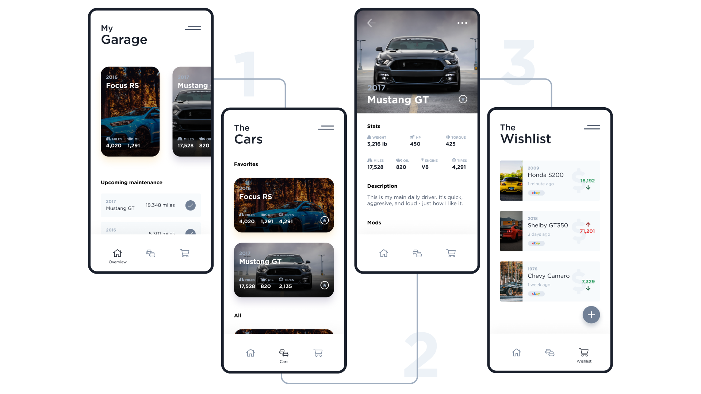
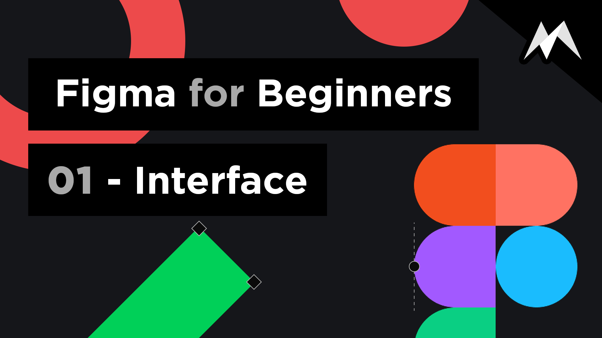

I started making YouTube videos in the middle of 2019. The videos were designed to educate others in the realm of design through practical experience. As a developer and designer I recognize that my skills can always be improved, which is why the videos I make I do from an area of personal experience. My videos were created to help other designers grow their technical skills in different tools, or grow their design knowledge through practice videos and speed art videos.

##### Design Speed Art
Speed art videos are short timelapsed 8-10 minute videos that are useful for showing the iterative and thoughtful process of design. They usually don't include any voiceover (just music) and serve as a great way to get inside the head of another designer. I've found that seeing how other people work can bring new insights or improvements into your own personal workflow. The projects I record while making speed art videos are designs that I make for fun and to practice new skills. This insures that there will always be something new to gain from a speed art video, outside of just enjoying the aesthetics that is.

Web Design & UI Design

##### Tutorials
Being a modern designer means adapting to both new technology and new tools all the time. I am a believer that there can never be enough knowledge shared online. I was self taught in my skills and YouTube played a big part in that, it is only fair that I provide back to the source that helped me. I focus on technical tutorials for various design tools (like Figma, Invision Studio, etc) and then using those skills walk through practical design exercises using them.

Figma Tutorials

##### The Channel
If you are interested in watching any of the videos you can find them on YouTube! Most of the finished designs from the speed art videos can be found on Dribbble.

