When Alienware announced their new branding in 2018 they also wanted a new Command Center for their users to get the most of the new hardware. Command Center allows Alienware users to customize the performance of their machine and also customize the lighting of the rig and create complex configurations that adapt to various games/apps. With this new Command Center there was a chance to bring new functionality and update the existing functionality to the demands of the 21st century.

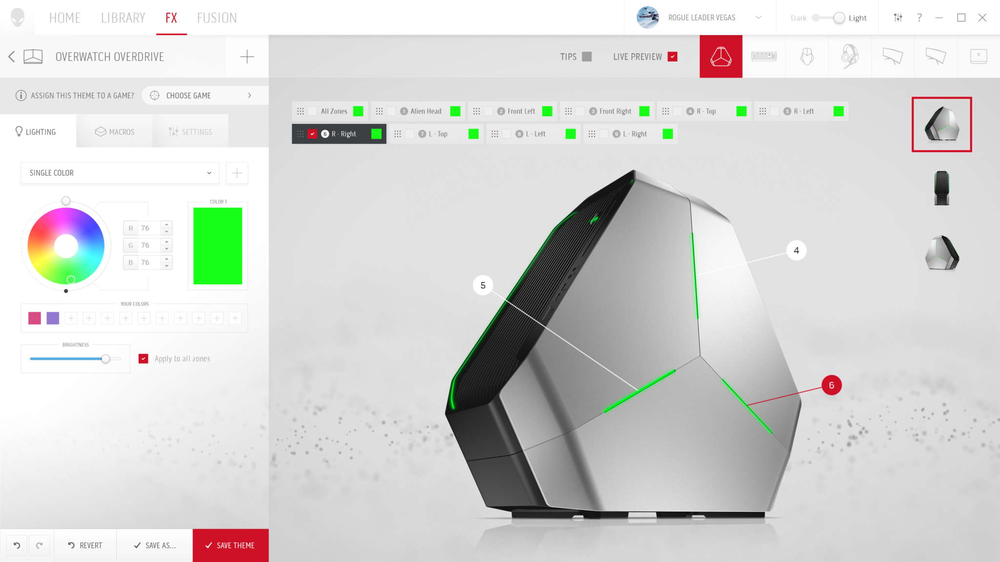

Command Center home screen (light)

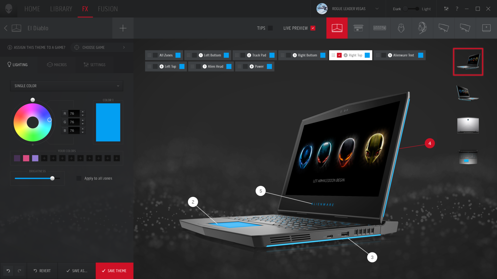
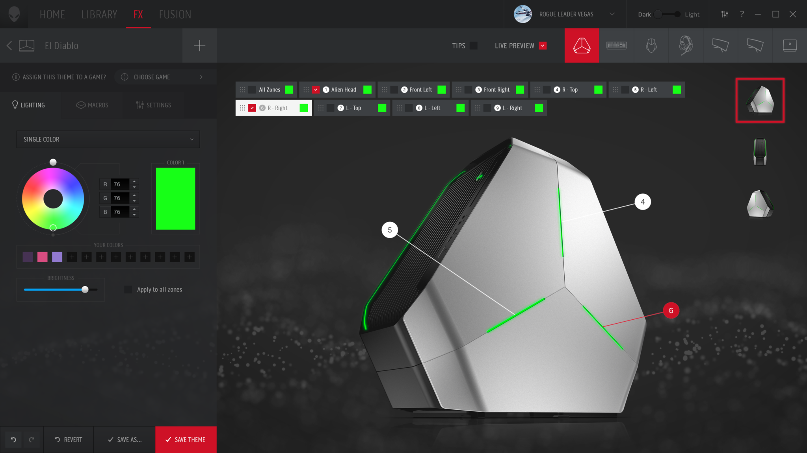

Command Center home screen (dark)

#### Research & Wireframing

The goal with the new Command Center was not just a simply visual update. We wanted to rethink the entire structure of the program. Alienware was updating it's industrial language and the goal was to bring the UI to a higher standard to match the new ID. We had a solid foundation for our user base which is something that shouldn't be taken lightly. This program comes preinstalled on every Alienware, so it needs to work and be easy to use.

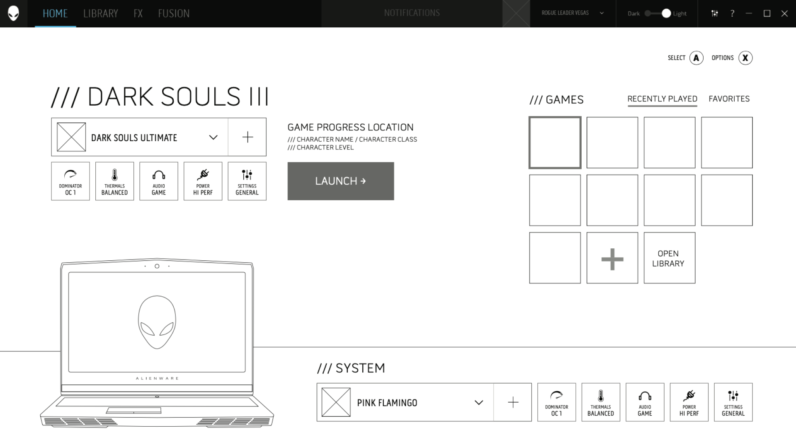

Homepage wireframe

We approached this by creating wireframes of every planned action. That isn't always necessary once the initial UX patterns are established, but in this scenario it would be extremely challenging to provide updates down the road as the software gets installed at the factory initially. The goal was to get as much locked down upfront as we could. We did this via many user studies and hands-on interactive prototypes made from the wireframes. This proved invaluable later as we could really focus on the design and visuals once we knew the UX was solid. We looked at several different programs in various fields (Game libraries, RGB software, IoT interfaces) so we could bring the best of all of it since Command Center includes many unique "modules". This was another great use of the wireframing effort. 

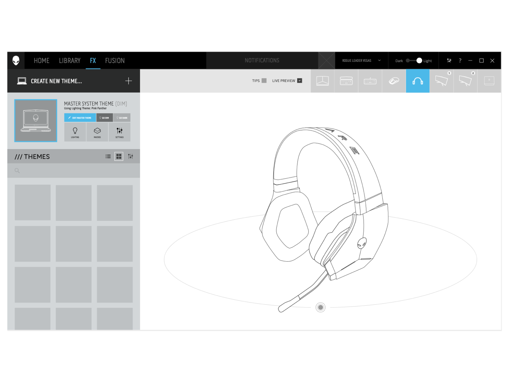
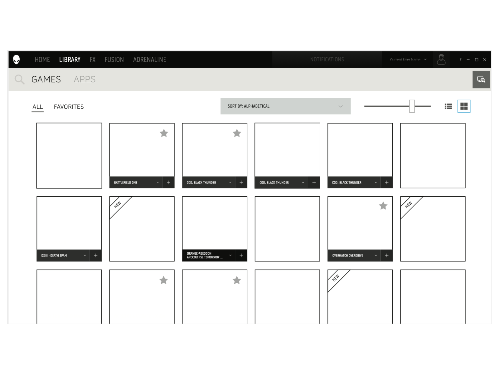

Command Center home screen (light)

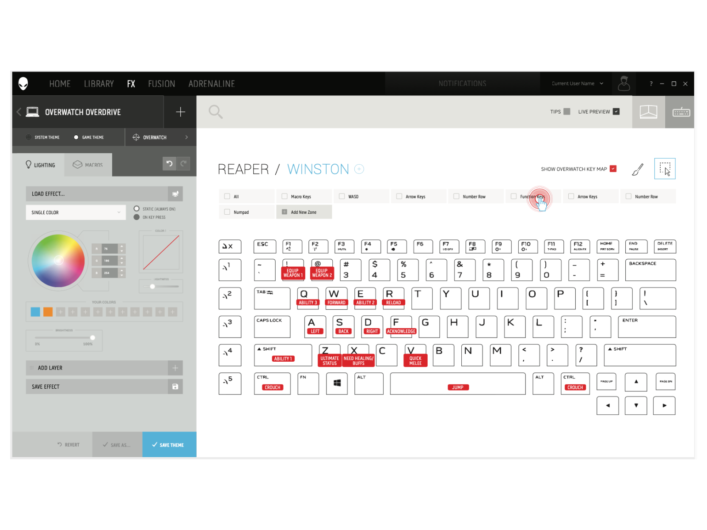
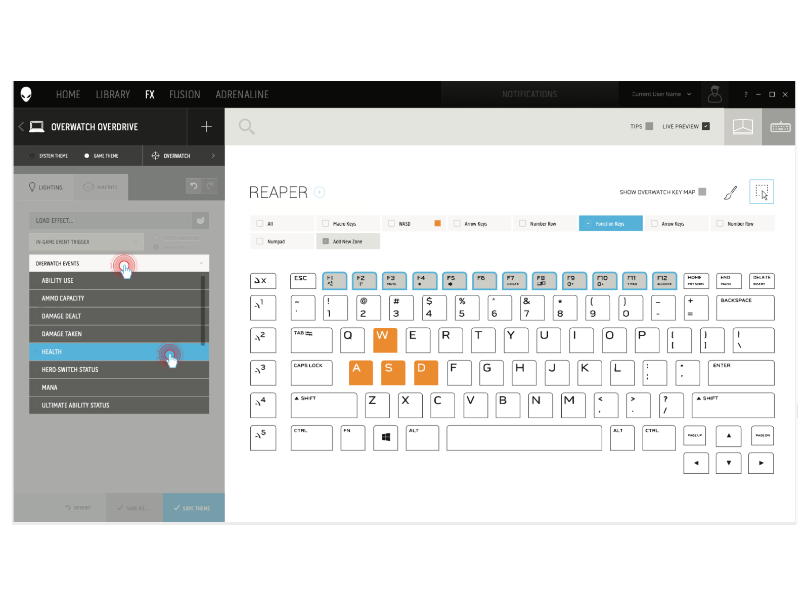

Command Center home screen (dark)

#### New Design Language

Designed a new visual language for Alienware that pushes the boundaries of traditional "flat" UI. This new language brought in subtle hints of light and shadow, transparency, depth, and dimensionality. Creating the new Command Center involved designing a new design language that allows for UI customization to be dynamic in various ways. The desire was for the Command Center to be a heavily user customized experience. This is shown throughout the UI in the primary color being pulled from the current color theme of the system and with the particle effects seen in the background that I designed and animated. The particles can be configured by the user to match their style.

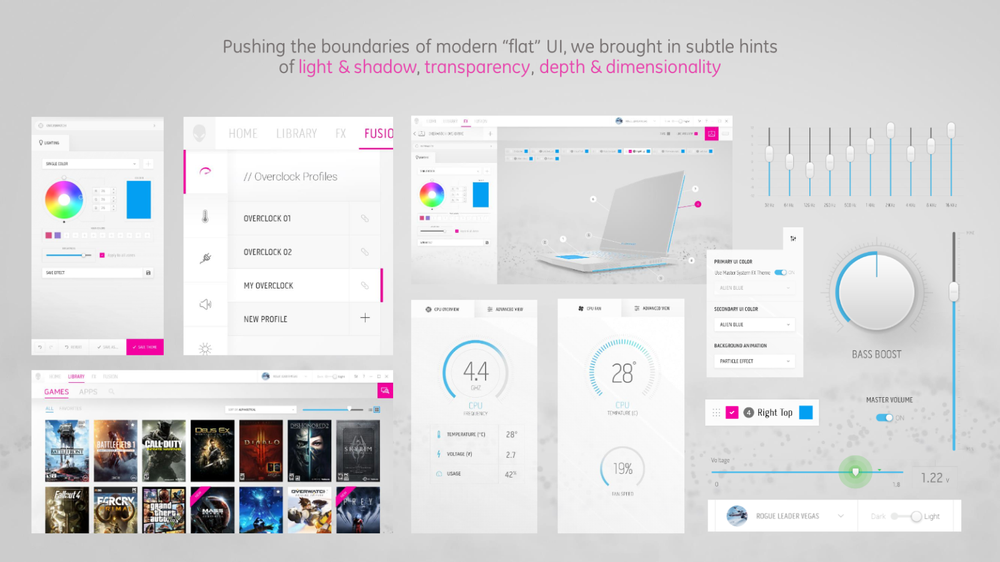

New design language

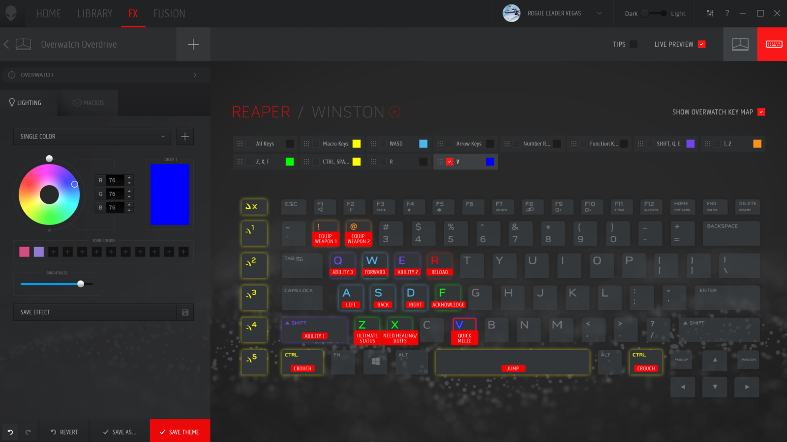
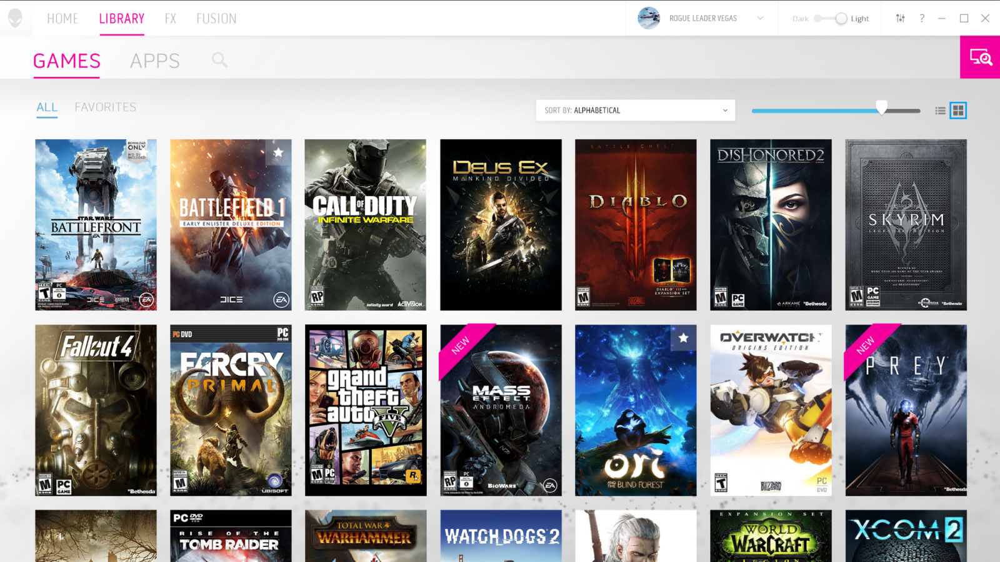

Flexible design allows for complex layouts

The visuals were heavily influenced by the updated industrial design of the Alienware products. Sharp edges, sci-fi inspired colors, and a heavy use of light and shadows to direct the users attention to key elements.

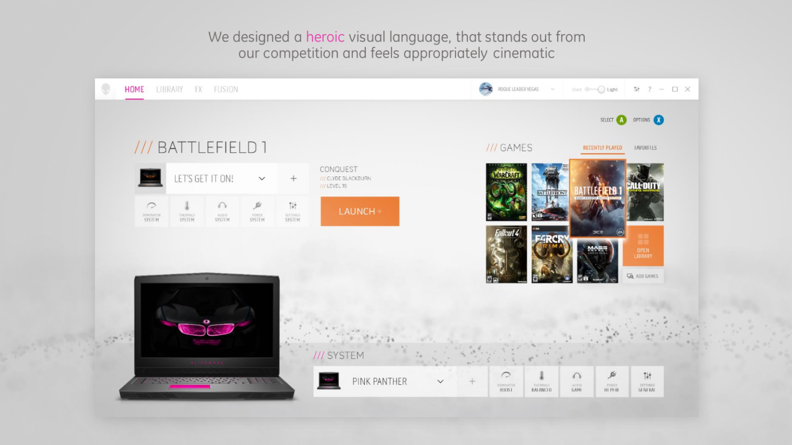

Inspired by the new industrial design of Alienware

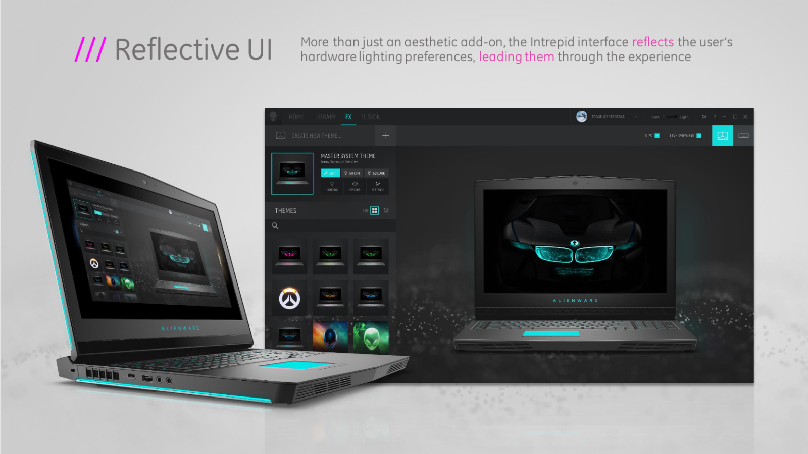
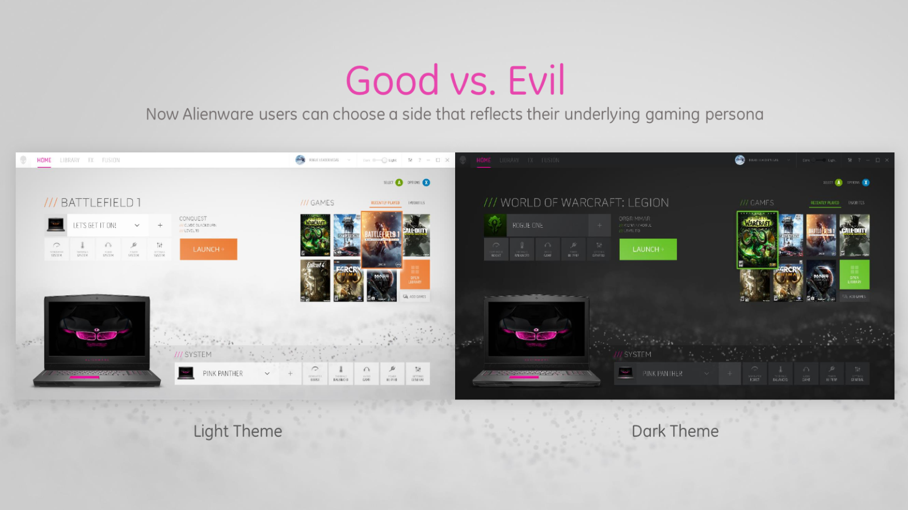

Personalization has a key feature

#### Video Demo

Part of the beauty of the new Command Center is seeing it in motion. This is an animated mock up made during the design phase which showcases some of the unique motion elements of the design.

<video width="100%" controls loop>
<source src="/hero-intro.mp4" type="video/mp4">
</video>

#### Awards

