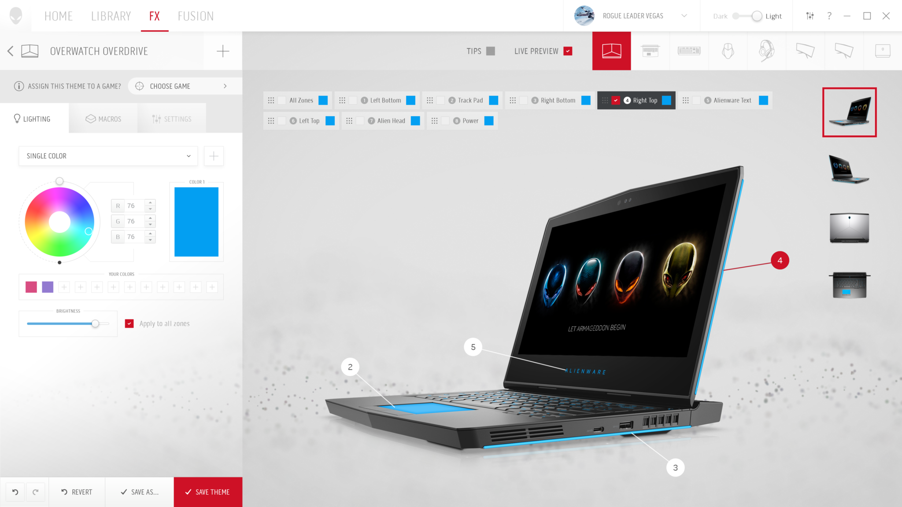

When Alienware announced their new branding in 2018 they also wanted a new Command Center for their users to get the most of the new hardware. Command Center allows Alienware users to customize the performance of their machine and also customize the lighting of the rig and create complex configurations that adapt to various games/apps. With this new Command Center there was a chance to bring new functionality and update the existing functionality to the demands of the 21st century.

Command Center home screen (light)

Command Center home screen (dark)

##### New Design Language

Creating the new Command Center involved designing a new design language that allows for UI customization to be dynamic in various ways. The desire was for the Command Center to be a heavily user customized experience. This is shown throughout the UI in the primary color being pulled from the current color theme of the system and with the particle effects seen in the background that I designed and animated. The particles can be configured by the user to match their style.

<video width="100%" controls loop>
<source src="/alienware-dark-wave.mp4" type="video/mp4">
</video>

##### Awards

