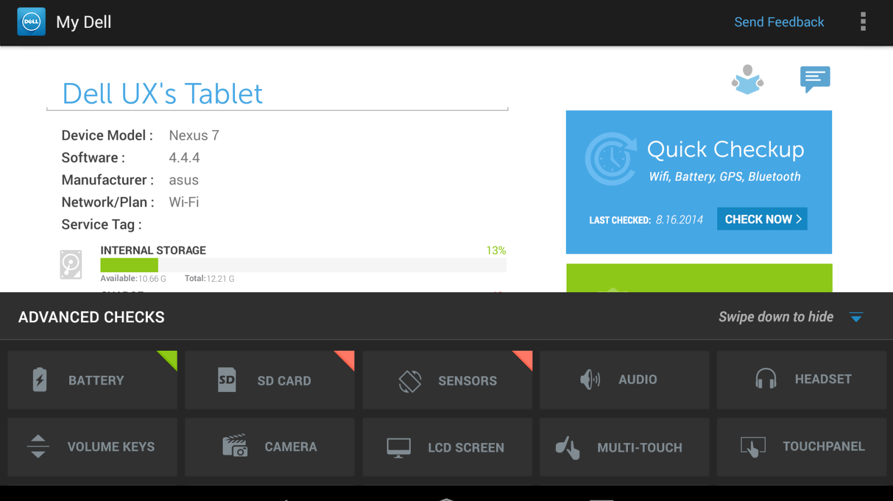
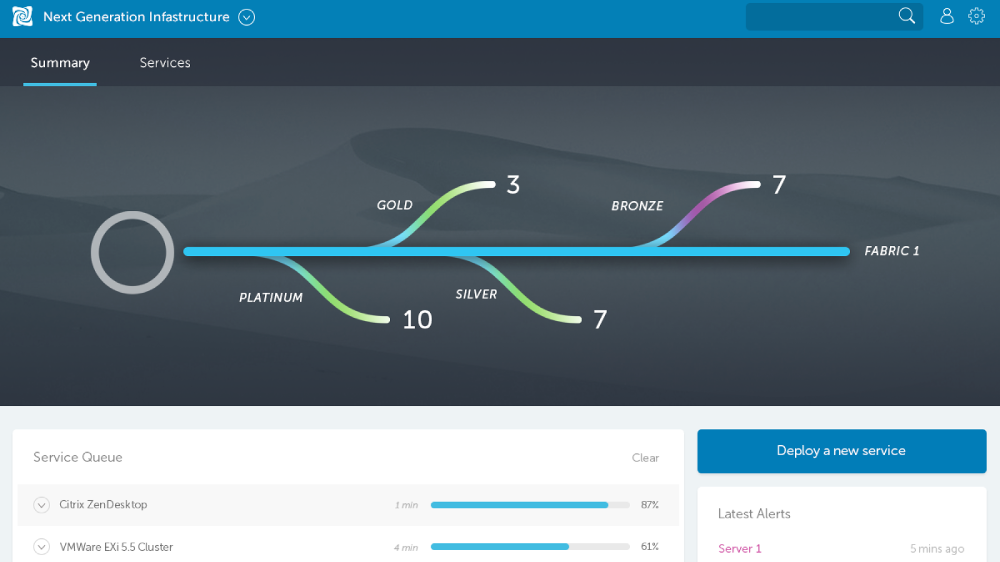
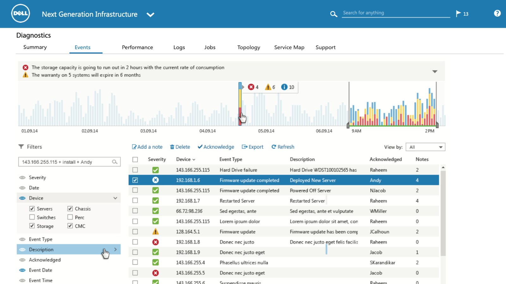
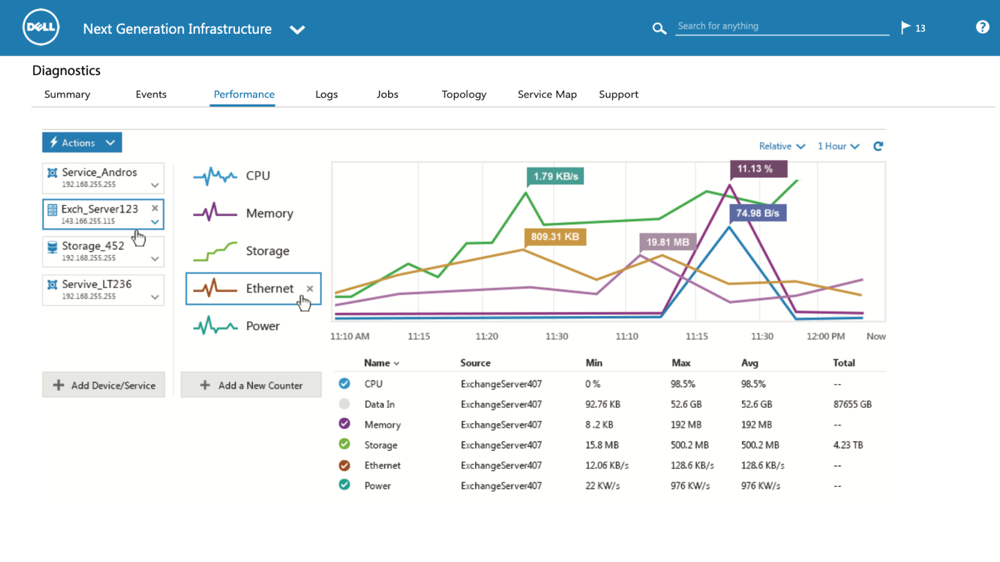
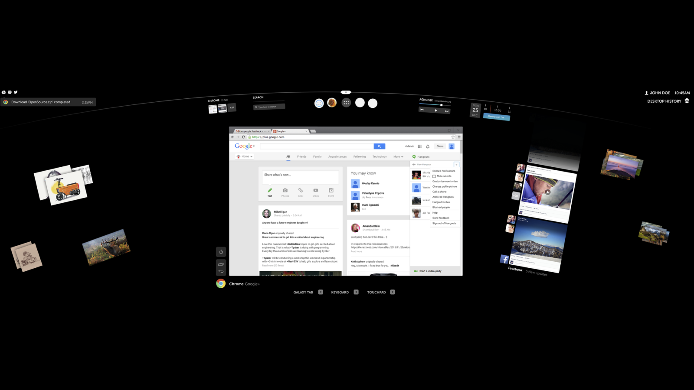
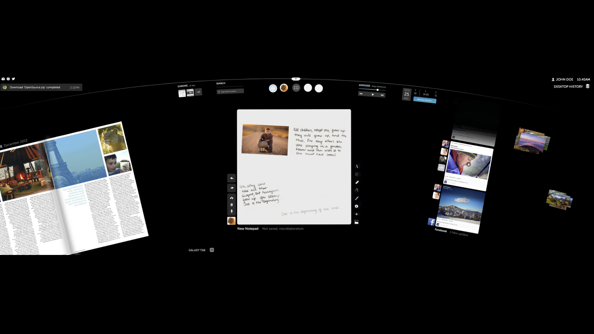
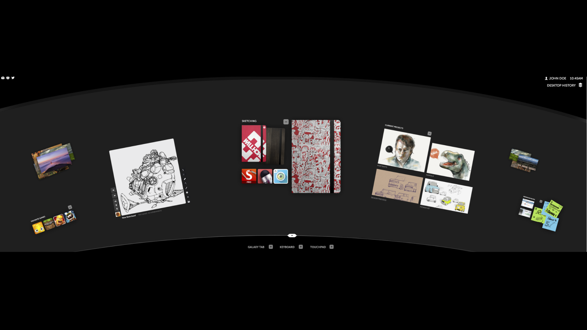
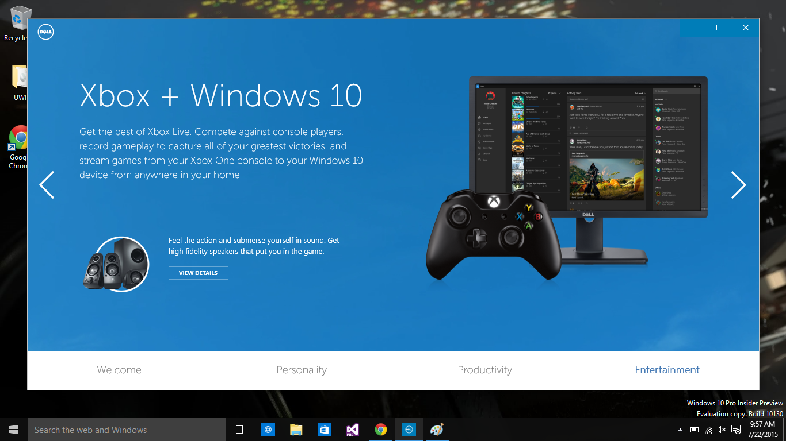
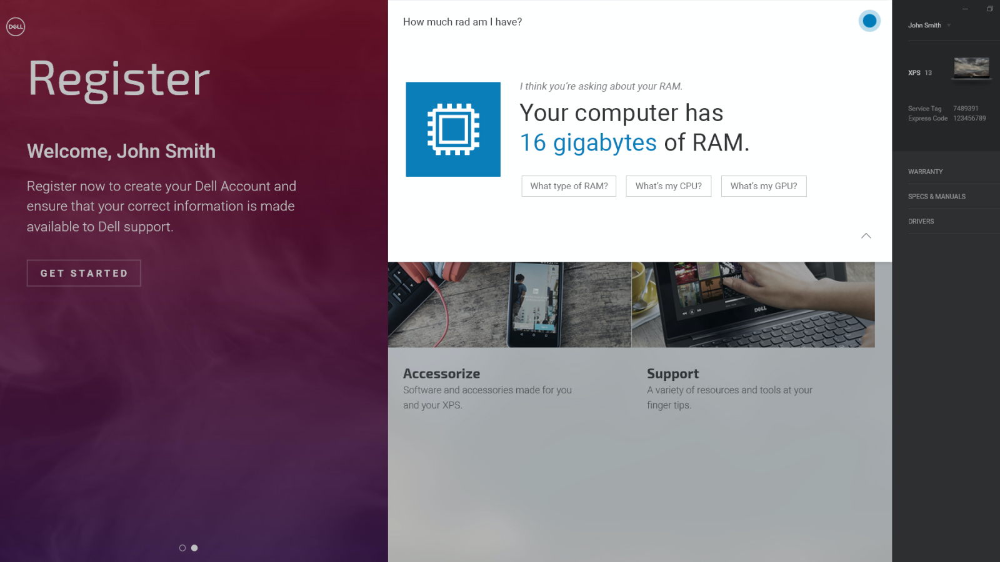
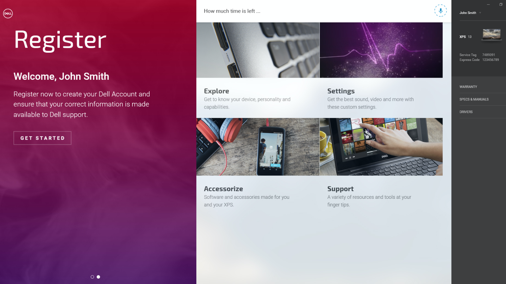

I worked with the R&D design and development team within Dell to create and explore the future of Dell's products. I sometimes refer to this work as 'Conceptual UI/UX Design' as the work can vary the medium in which the 'interface' exists. Traditional UI design refers explicitly to the screens we are used to today, like our phones and monitors. The R&D team dealt with future looking concepts, like having a projected 'interface' displayed on your desk, or an 'interface' with no visuals only haptic feedback. This experience allowed for deep creativity and an abundance of problem solving.

Prototype Android applications

Enterprise applications integrated with Deep Data

##### New Technologies

Exploring the future is exciting but it isn't without limits. I worked to understand the limits while finding out how far we could stretch them to fit our future vision. This involved speaking with industry leading companies and new tech start-ups to understand current limits and discuss future technical possibilities and partnerships that may allow Dell's future vision to come to life. We would design, animate, and prototype these ideas to solidify the direction we wanted to guide our partners towards. 

Prototype projector interface application

Prototype projector interface application pages

##### New Users

A unique challenge to design future looking software is identifying the user base for it. Dell has an established audience for many of it's softwares already, which can provide a solid base for growth. To expand on that foundation the team and I conducted many user interviews and Q/A studies on existing products. Utilizing this knowledge we began to build user personas that represented long term goals of the users who were interviewed.

Dell 'Welcome to Windows 10'

Closer to the home front we also explored ways to better integrate new technologies into existing Dell applications. A large effort was in the out of box experience, or OOBE for short, on various Dell support products. The vision was to merge these apps into a larger 'Hub' that could act as a center for your computer's information and for the Dell features that came with it. 

This hub utilized a new AI search bar and personal assistant that was developed and researched in the R&D team. The goal here was to connect with the users on a more personal level. Future looking versions of this experience would respond to the users mood to better communicate with them during computer troubles.

Dell Hub

<video width="100%" controls loop>
<source src="/hub-oobe.mov" type="video/mp4">
</video>

Dell Hub OOBE Experience
