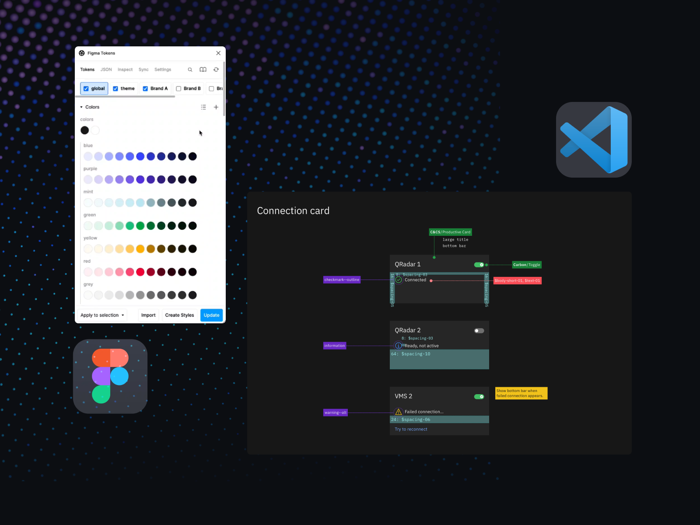

Joining the Security organization within IBM, I built and attached a design team to an existing engineering-only product team, IBM's Risk Manager. There was a unique opportunity to elevate the product experience, create UI consistency, find new ways to bring delight to our users. With such ambition it became clear the biggest challenge would come in the form of cross-functional alignment and communication. This is how I built a design team that blurred the previously solid boundaries of design/development within Risk Manager over the course of a year.

Risk Manager UI

#### Building a team
Starting my career in frontend development and eventually transitioning to product design has given me one of my most valued skill sets working in the tech space... context.

Context is everything, context creates relatability, context gives you a foundation, and context gives teams the translational base-layer needed to speak efficiently between their x-functional disciplines.

Spark Festival Design Presentation

This is where I like to start with teams, regardless of it being a new team from scratch or a team being transplanted in to an existing group. At IBM I presented these thoughts during their internal design conference, <i>Spark Festival</i>, and used that presentation as the groundwork for how I lead Risk Manager's new design team. 

Figma tokens, Carbon Design, Tools for alignment

In practice for us this looked like moving towards tools that help design/development speak the same language. For example, using Figma to generate design tokens that are used in the product code, Framer prototypes using referenceable React components. We also were careful on the internal language we used, "handoff" was a no-go for us. Keeping the teams involved throughout the process from idea onto release helped increase not only our product quality (which in turn brought more delight to our users) but also our team relationships as we all continued to learn more about the inner-workings of "the machine" that is our product team.

#### New foundations
Rocking the boat is a term tossed around to encourage using what you have and staying the same. My time within the Security organization highlighted their willingness to "...do the right thing the first time" as our design director would say. They backed my request to rebuild Risk Manager with foundations that would scale as the team grew, would allow us to meet the high demands for accessibility, and importantly align with the upcoming Carbon Design System updates.

Rethinking page flows and risk models (some data blurred)

We used this opportunity to rethink the data flow of pages, but also exploring what <i>Risk</i> even meant for our product, and for IBM. Our product had ambitions of leading the internal product landscape and we wanted to present <i>Risk</i> clearly for both our users and for our teams.

#### Testing... Testing... anyone hear me?
At the core of IBM Design is this effort to maintain Empathy in your work. In practice this can be challenging, things move fast, testing is slow, synthesizing feedback can create more questions, and so on. That said the results from teams that take this seriously are obvious. Users first was and still is Risk Manager's position. We would conduct external user reviews and prototype testing while collecting feedback around different product goals and "hills" as Enterprise Design Thinking calls them. 

User testing results

We also collected feedback in internal Design and User Experience reviews. These are rigorous, slightly optional, internal tests that can bring some truly amazing results - but at the "risk" of forced accountability with executive leadership.

D&UX testing results

In the past Risk Manager struggled in these tests, but in the year following the creation of Risk Manager's design team we were able to bring increasing grades to these tests with clarity around next steps and solutions that would be presented to exec leadership.

#### Results
As I ended my time at IBM we had gotten Risk Manager out of the fire and into not only a functional rhythm but a team leading the charge on what <i>Risk</i> meant within IBM.

The design team created new patterns, improved the redline experience, established regular cadences with the development team, realigned everyone involved on the vision/mission for the product, and most importantly learned to speak the same language.

Tokens, symbols, redlines, and new "module" components

Some of the other seeds planted while I was there are starting to take root now as Security as a whole organization is now moving to tools like Figma to further increase the interconnectivity of teams while reducing "handoff" mentality.

Risk Manager

#### Closing thoughts
My goal over the year I was at IBM was to build a design team and set them up for success. The problem space of cross-functional dynamics brings me a lot of joy to work within. It's a fascinating representation of humanity, people largely want the same thing but don't speak the same language. Sometimes all you need is a translator.