

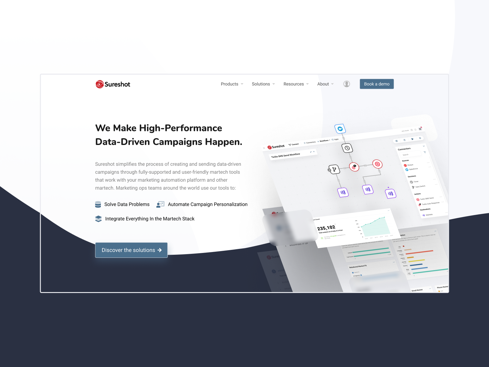

Sureshot Website

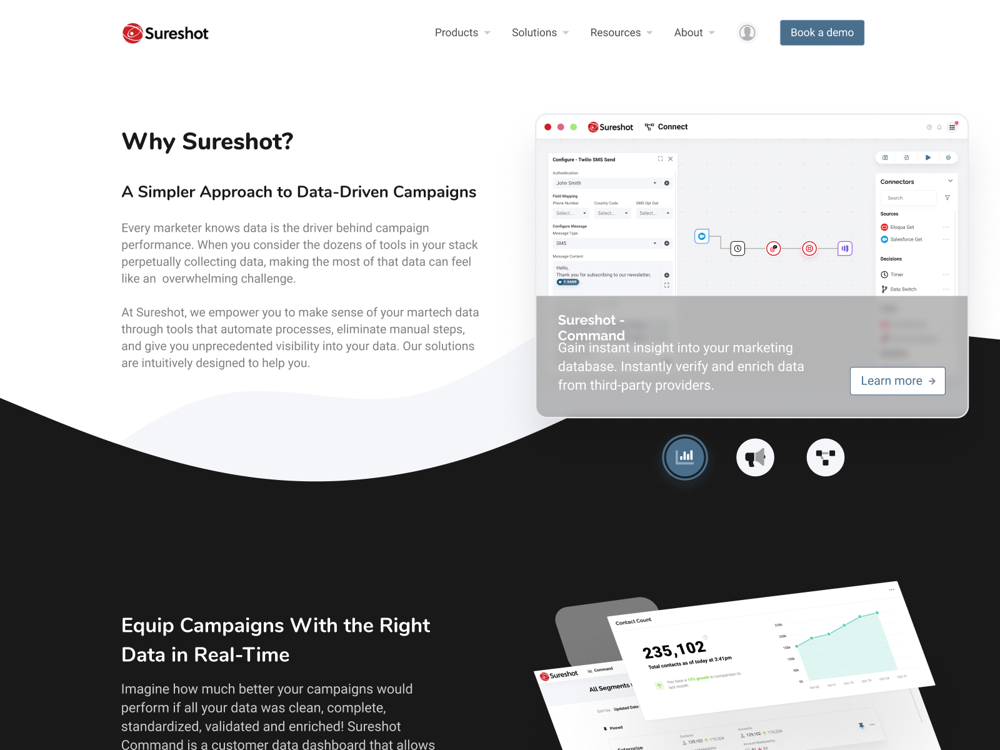
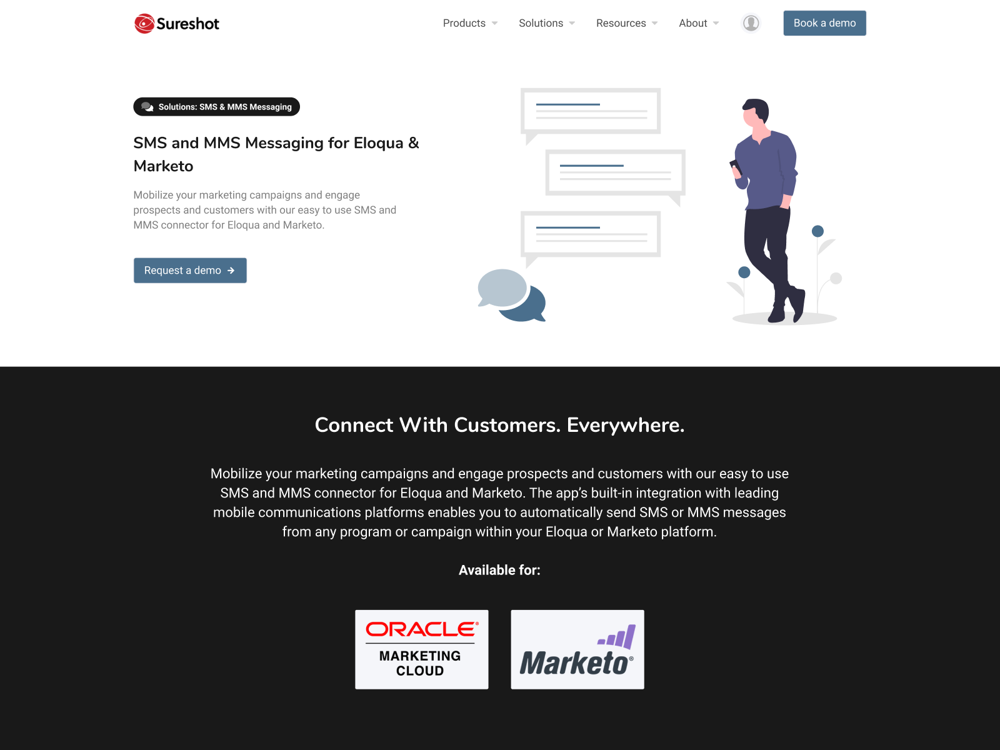

About Us page - Solution page

#### Modernize
The corporate redesign was an effort to modernize the elements of Sureshot to better connect with their clients. Sureshot competes in the world of marketing tools, and this area is full of large high-tech companies with significant cloud capabilities. The clients of Sureshot are modern and future looking users. The rebranding effort helps connect with this audience by engaging them with clean and modern visuals and compelling imagery from Sureshot’s software.

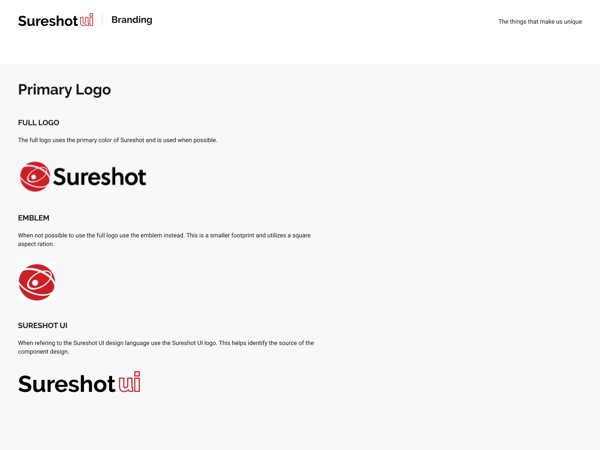
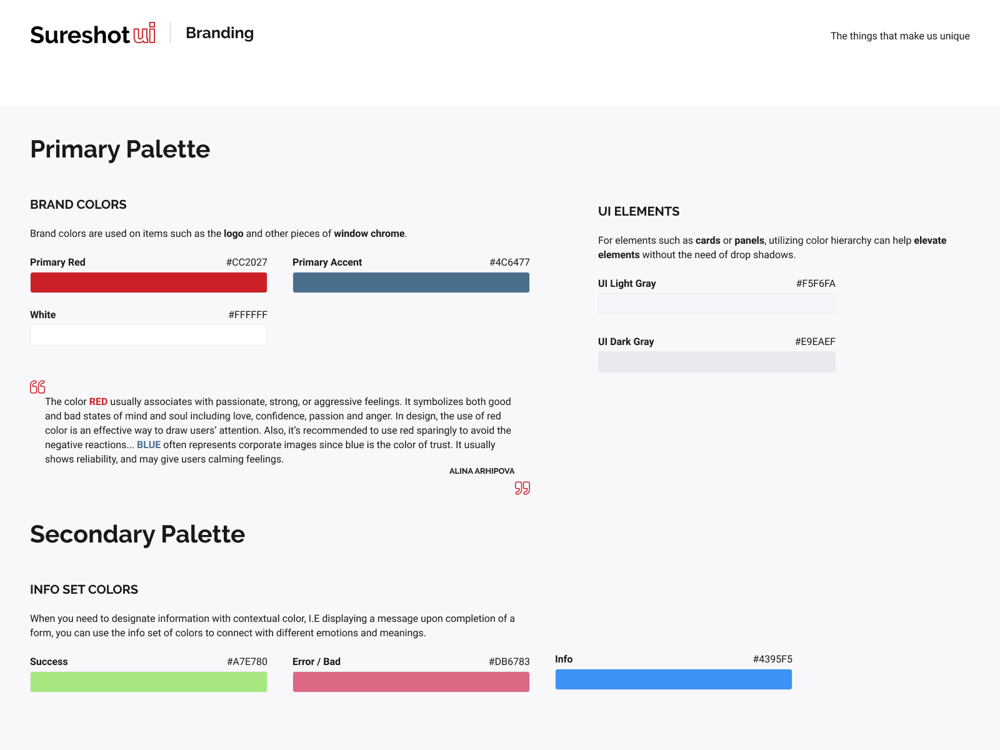

Glimpse at branding assets

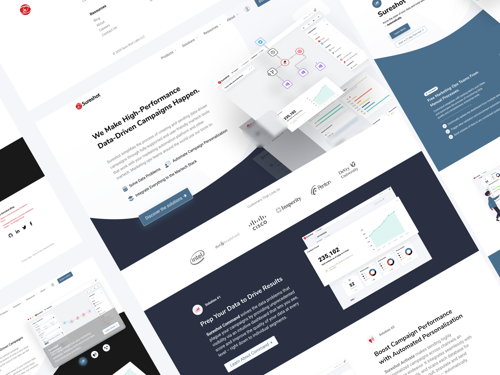
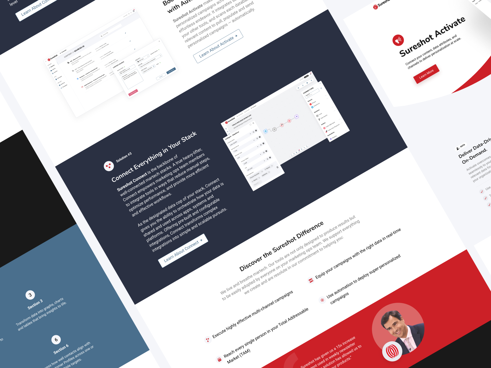

Various Sureshot website and Sureshot UI pages

#### Wireframes
The corporate website was getting some much needed love. There was a new brand direction including a new design language that Sureshot's products now use. I wanted the new website to encompass these elements in a visually striking manner. This meant reimagining the structure and layout of the site so that it's foundation would support a more visual narrative. I approach these problems by exploring various layouts with traditional wireframing techniques. In this situation I could focus mainly on how the content would be paired with the large screenshots since there would need to be good balance now that Sureshot had compelling visuals to showoff.

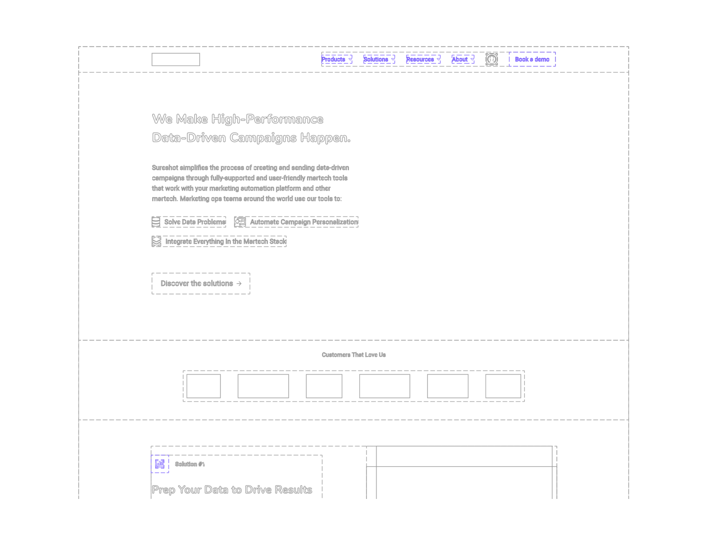
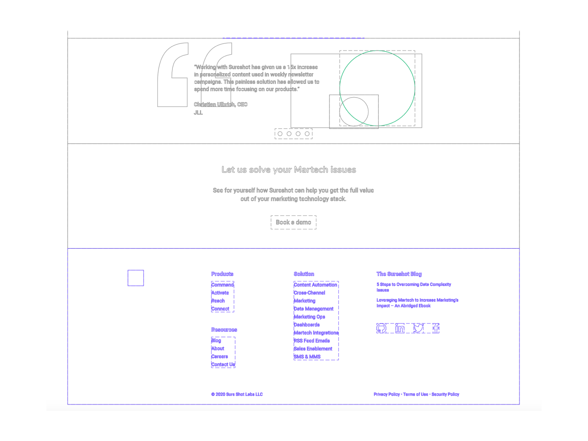

Homepage layout wireframes

#### Ecosystem
Rebranding offers a lot of new opportunities that otherwise can be challenging to accomplish. I utilized this effort to align all of Sureshot’s visual languages together as one. This means the corporate branding, the sales website, and the products all belong to the same family. The goal here was to create a Sureshot ecosystem - an entire experience within Sureshot’s product network. Keeping clients in that network is key and by positively reinforcing consistent experiences and UX patterns it gives them strong reason to stay and not explore competitors.

Ecosytem of product visuals

#### Show don't tell
When it comes to selling products, words can be very powerful. However people buy with their eyes first. An issue that Sureshot initially faced was failing to compel their clients to explore their products as no product imagery was ever shown. The new corporate website offers modern and visually compelling imagery designed to engage the potential client with Sureshot’s offerings. This was done through unique product screenshots to keep the eye engaged with the content.

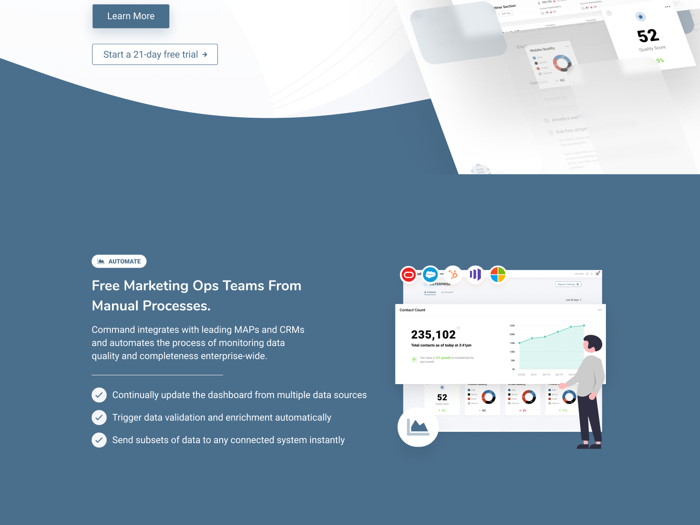
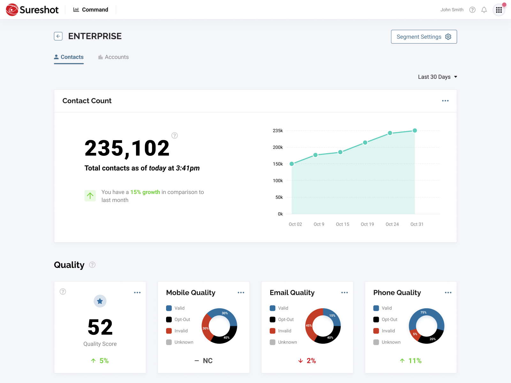

Command Screenshot compared to source product

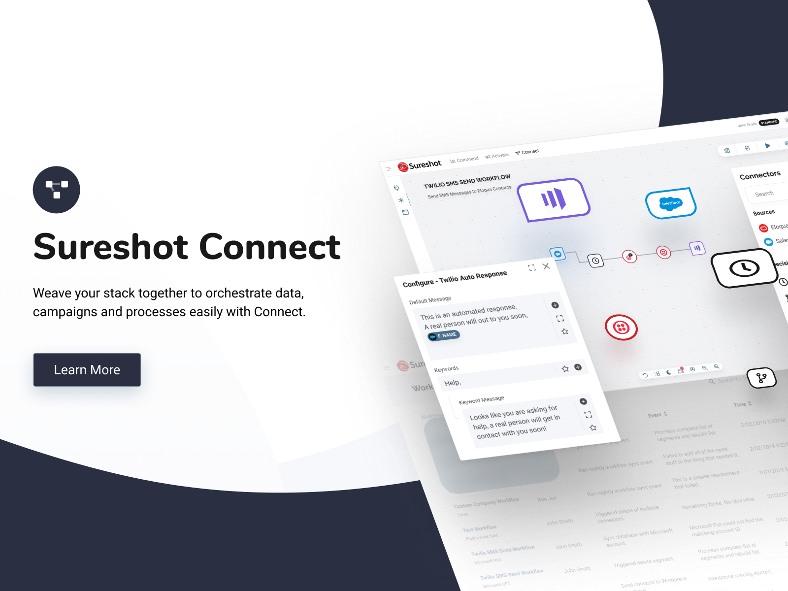
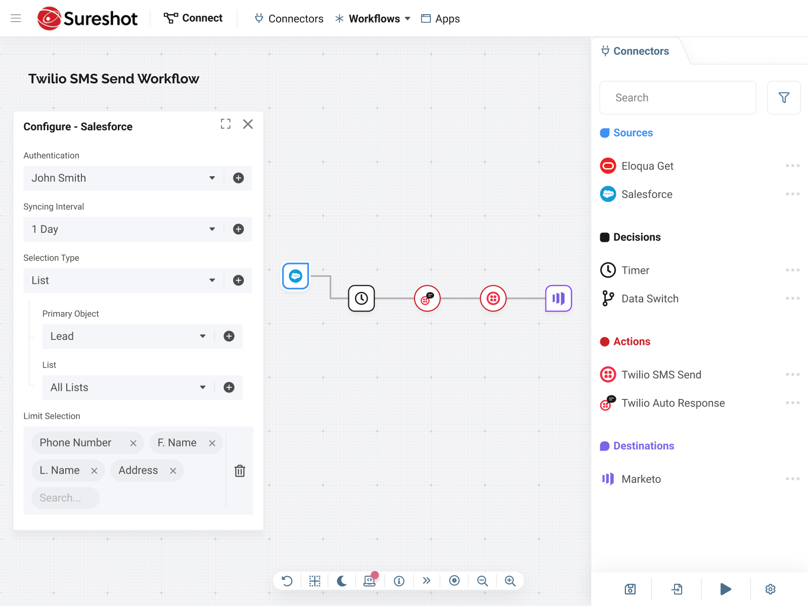

Connect screenshot compared to source product

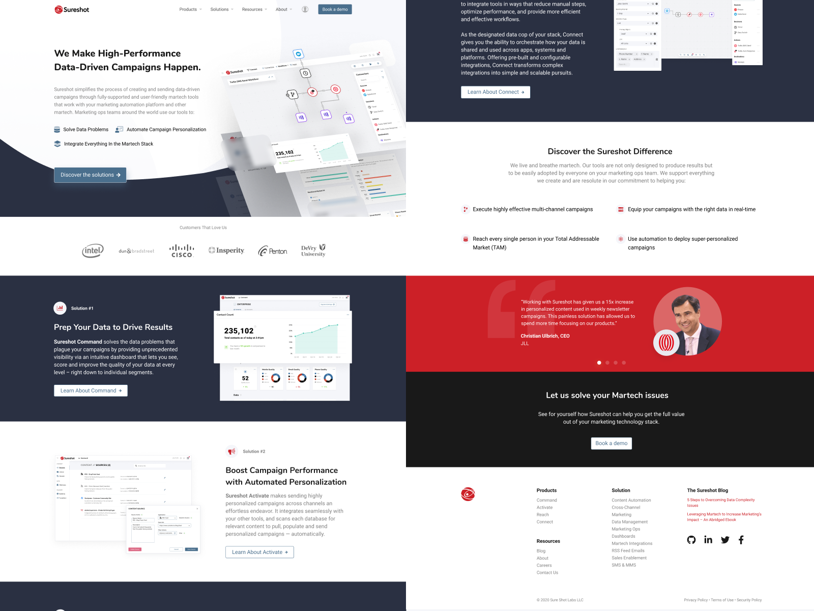

Sureshot Website

#### Live Link

Curious about the current live version? Check it out with the arrow below.