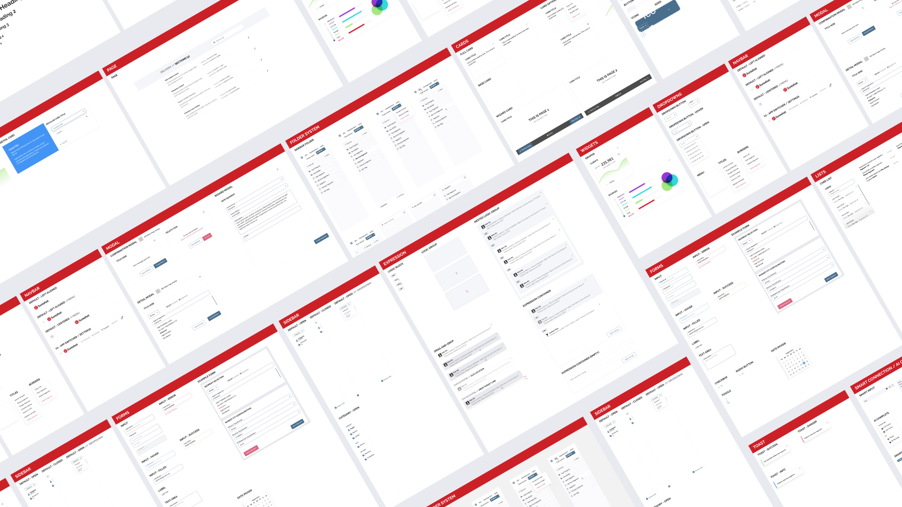
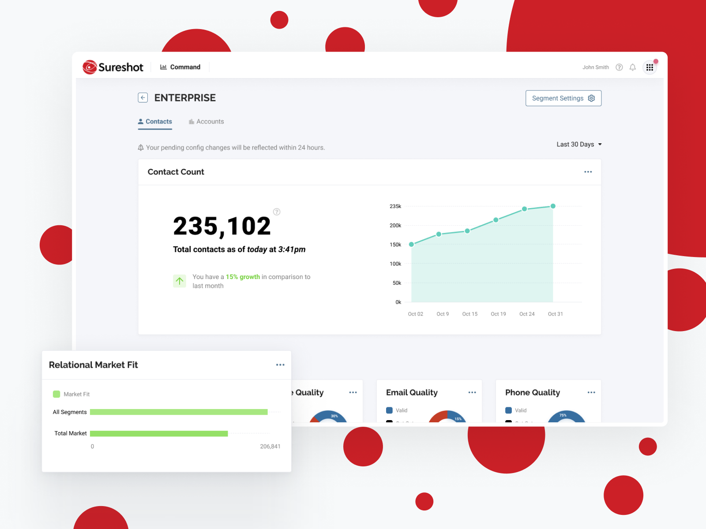
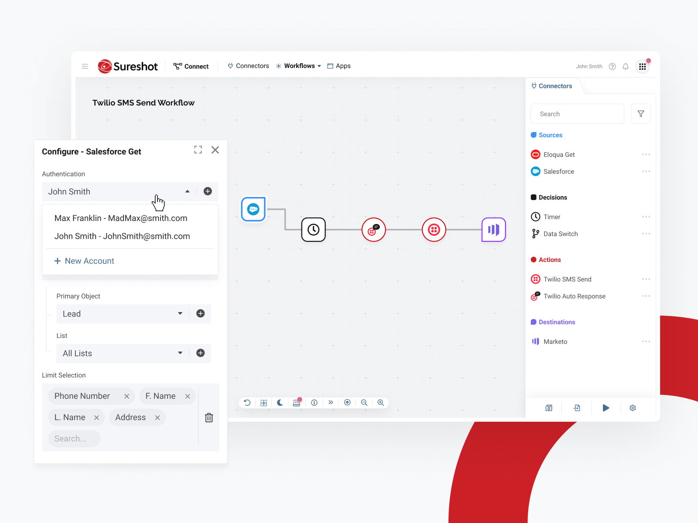
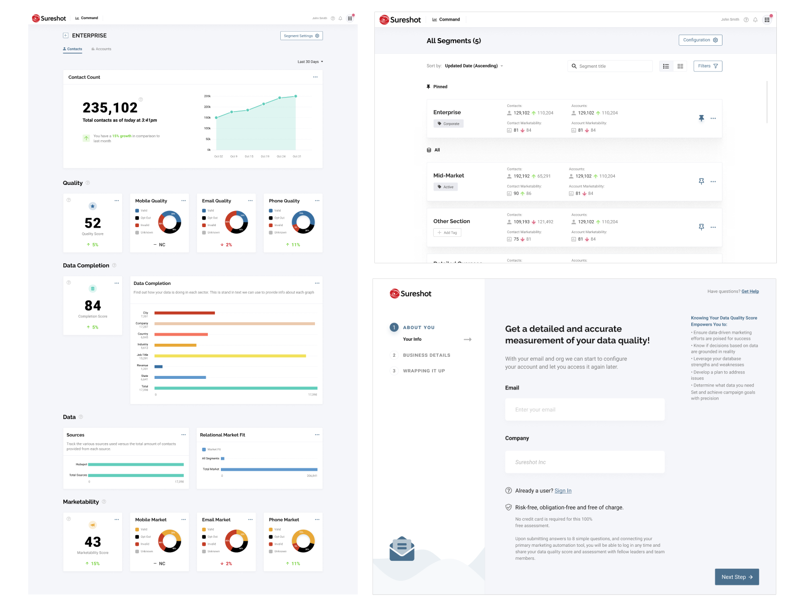
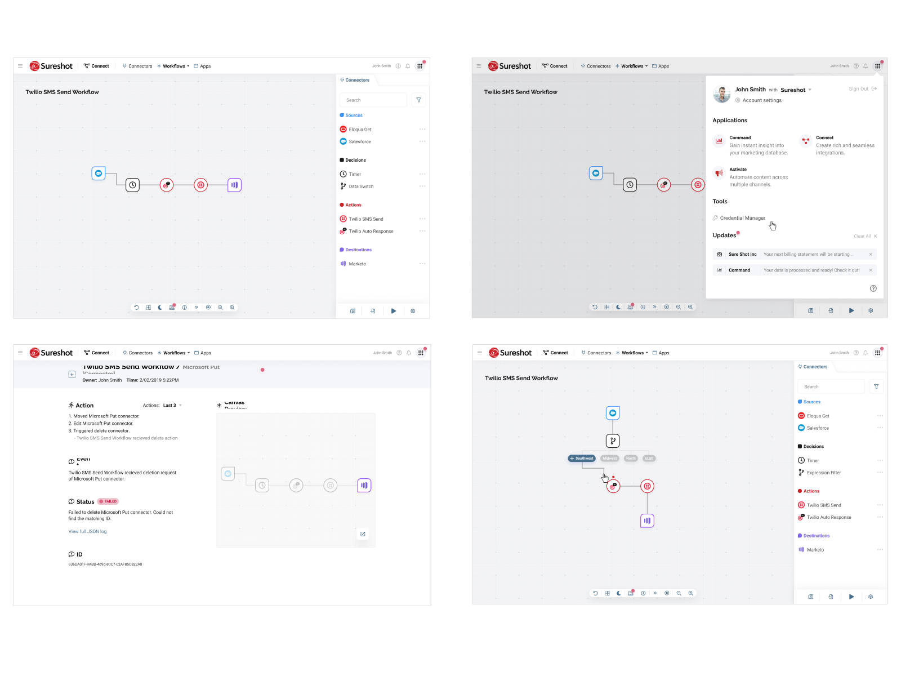
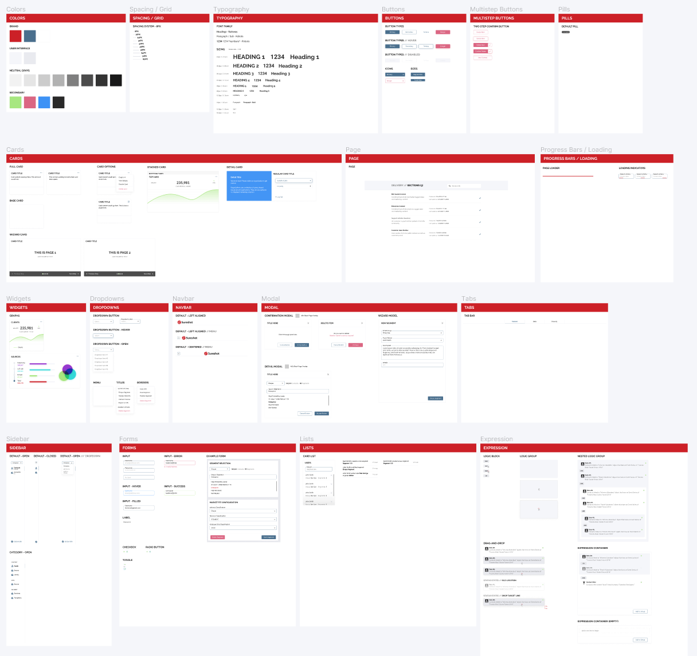
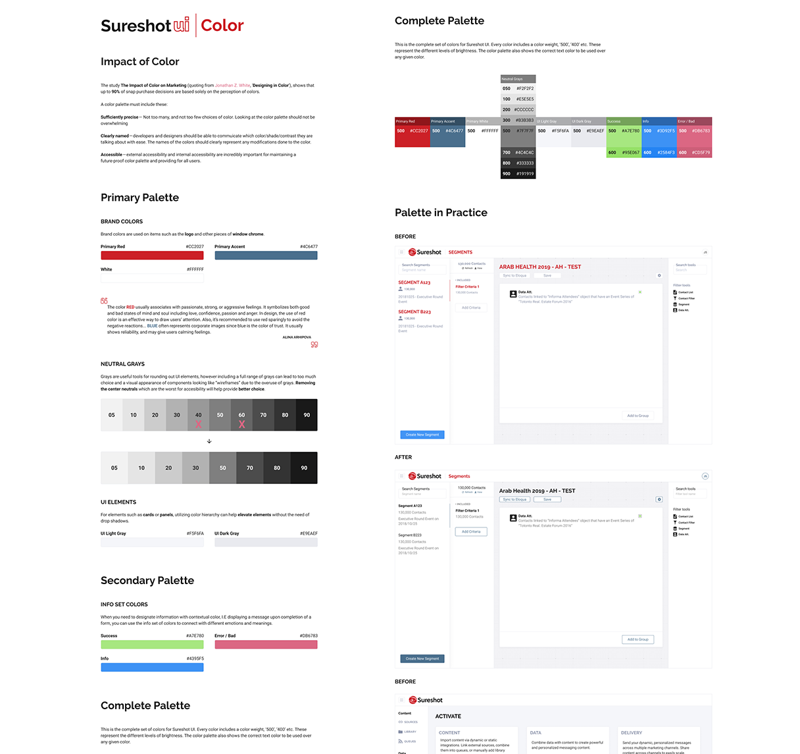
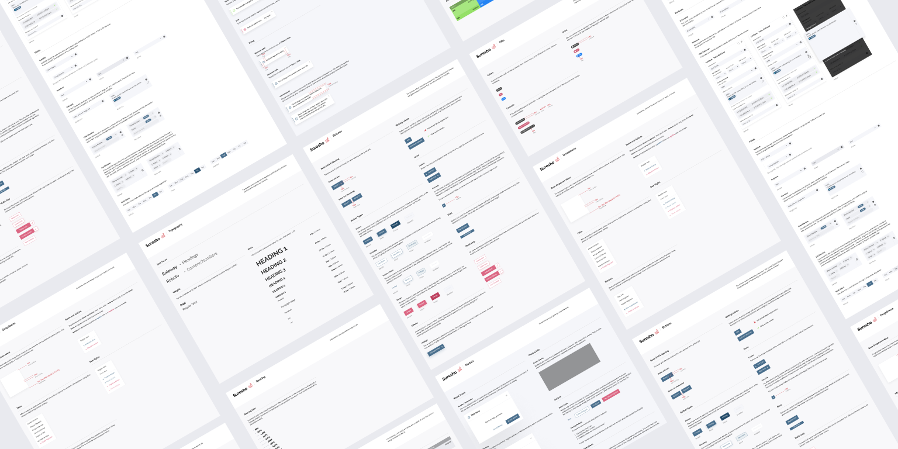
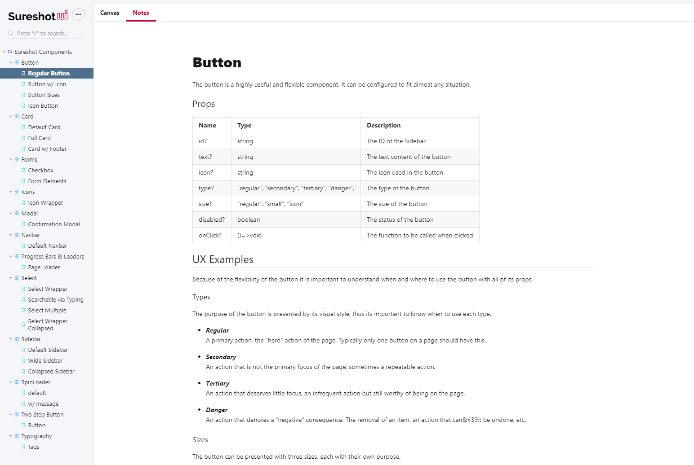
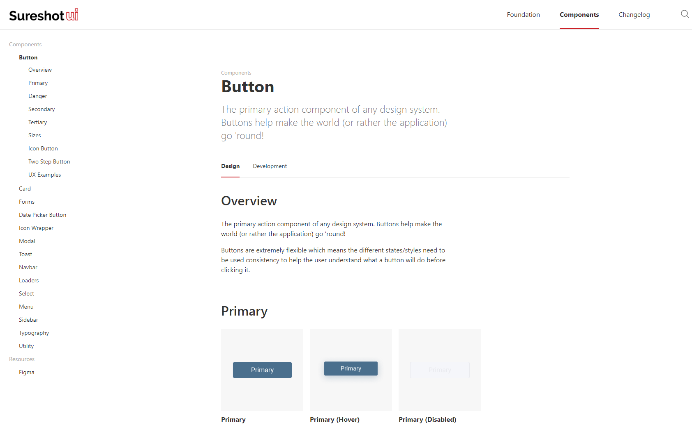

Sureshot UI example components

#### Simplify, simplify, simplify
The goal for the Sureshot design system (now called Sureshot UI) was to align all of the existing and new products visually and functionally. Sureshot provides many different products and they encourage the customer/user to switch between different products for different needs, similar to how the Google web app suite works. A key part of that business model is keeping users integrated into your products. If your products are not consistent in appearance and functionality it trains the user to be comfortable with switching product ecosystems since they have already gotten used to different visuals and workflows. 

Sureshot Command - Sureshot Connect

Sureshot UI aligned the visual language of the products with well documented UX patterns. This new consistency not only improved the appearance of the applications but also helped define the Sureshot ecosystem of products. Removing the learning curve from each new application the user would visit by sharing consistent UX patterns and visuals keeps the user in the Sureshot world, not jumping between various different platforms and applications.

Consistent visual styling

#### Collaboration
Sureshot UI was built in a design tool called Figma utilizing the team features of the tool to allow others to collaborate and quickly iterate on designs. Everything was built as components so if a change was made it would propagate through all the designs, which saved countless hours due to the large artboard counts and sizes many of our mocks had.

Sureshot UI Figma

As the design language grew it also become better documented so that the team can reference components for UX guides and usage instructions. This is useful for those who are wanting to make new designs or for developers who are implementing/tweaking components.

Sureshot UI Figma Documentation

#### Future-proofing
Part of building a strong design system and product catalog is building applications that will scale. An often overlooked requirement is building well documented products internally with a solid onboarding experience. Sureshot UI was built on the idea that any questions surrounding the library could be solved with resources also provided by the library. Sureshot UI has solid documentation, visual examples, API/prop lists with explanations, Storybook JS integration, as well as being written in Typescript with custom types (along with our other products as well).

Sureshot UI Dev Documentation Example

#### Business Outcomes
At the end of this effort Sureshot went from struggling to keep clients from switching to competitor products to easily selling an entire ecosystem to customers. The strong pairing of product design and functionality combined with the compelling nature of staying in a familiar and linked ecosystem increased Sureshot's business revenue and customer retention rates.